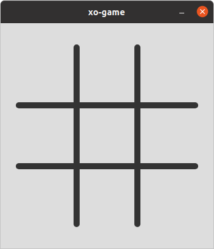
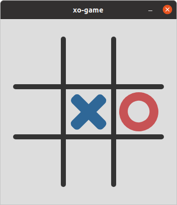

# Tic-Tac-Toe (XO) Game    

> built-with [@electron](https://github.com/electron/electron) and :heart:
>
> sound effect available

## Menu

-   [screenshots](#screenshots)
-   [shortcuts](#shortcuts)
-   [license](#license)

## Shortcuts

| Keys        | `F1`      | `F5`         | `F11`                  | `F12`    | `Alt` + `N`                | `Esc`                      |
| ----------- | --------- | ------------ | ---------------------- | -------- | -------------------------- | -------------------------- |
| Description | Show Info | Restart Game | Toggle Fullscreen Mode | DevTools | New Version (coming soons) | Close Game and Exit Window |

[⬆️ top](#menu)

## Screenshots

[⬆️ top](#menu)

## LICENSE

Under [MIT](./LICENSE) License
